<div align="center">

# 🤖 Investory Simulation API

### 개인의 투자 원칙을 실행 가능한 전략으로 변환하고, 과거 시장 데이터에서 검증하는 AI 백테스트 서버

**Natural Language Rule Compilation · Asynchronous Backtest · Monte Carlo · Investment Analytics · AI Report**


<br />

`FastAPI` · `RS256 / JWKS` · `Bounded Worker Pool` · `FinanceDataReader` · `Prometheus Metrics`

</div>

---

## Overview

Investory Simulation API는 사용자의 자연어 투자 원칙을 단순 텍스트로 보관하는 데서 끝내지 않고, **실제로 실행 가능한 Rule Schema로 변환한 뒤 과거 시장 데이터 위에서 검증**하는 전용 시뮬레이션 서버입니다.

Investory 전체 서비스의 `기록 → 분석 → 원칙 → 검증 → 복기` 사이클에서 마지막 두 단계를 담당합니다.

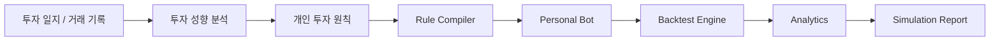

이 저장소는 단순 계산 API가 아니라 다음 책임을 하나의 독립 서비스로 분리합니다.

- 자연어 투자 원칙을 **8개 영역의 실행 규칙 JSON**으로 컴파일
- 실제 사용자 / 개인 원칙봇 / 유명 전략 / 랜덤봇을 동일 조건에서 백테스트
- 일별 자산, 체결 기록, MDD, 변동성, 종목·행동 기여도 등을 계산
- 랜덤 전략 Monte Carlo 분포와 개인 전략의 상대 위치 분석
- 실제 사용자와 원칙봇의 의사결정이 갈린 지점을 추출
- 결정론적 분석 결과를 기반으로 투자 복기 리포트 생성
- Spring Core Backend가 발급한 RS256 Access Token을 JWKS로 검증

---

# System Flow

시뮬레이션 실행은 HTTP 요청 하나에서 모든 계산을 끝내는 동기 방식으로 처리하지 않습니다.

무거운 백테스트·Monte Carlo·분석 작업은 **제출 → 상태 조회 → 결과 조회** 구조로 분리했습니다.

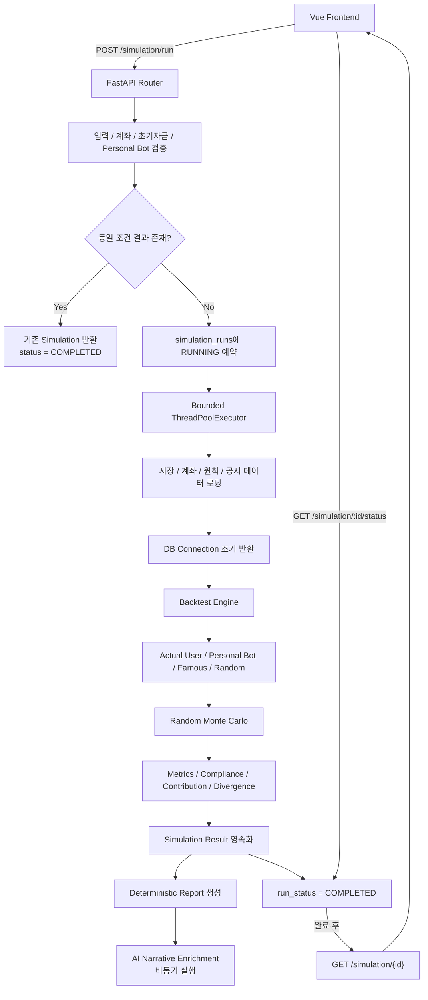

## 왜 비동기 Job 구조인가?

백테스트 한 번에는 시장 데이터 로딩뿐 아니라 여러 전략 실행, Monte Carlo, 분석, 리포트 생성이 함께 들어갑니다.

요청마다 `BackgroundTasks`를 무제한 실행하면 동시 요청 수만큼 CPU와 DB Connection을 경쟁하게 되므로, 서버는 **bounded `ThreadPoolExecutor`**를 사용해 실제 계산 동시 실행 수를 명시적으로 제한합니다.

```text
HTTP Request
    ↓
가벼운 검증 + Cache Lookup
    ↓
Simulation Run ID 즉시 반환
    ↓
Bounded Worker Queue
    ↓
Heavy Simulation
```

기본 worker 수는 환경 변수 `SIMULATION_RUN_WORKERS`로 조절합니다.

---

# Personal Bot Compilation

시뮬레이션 전에 사용자의 자연어 투자 원칙을 실제 백테스트 엔진이 이해할 수 있는 Rule Schema로 컴파일합니다.

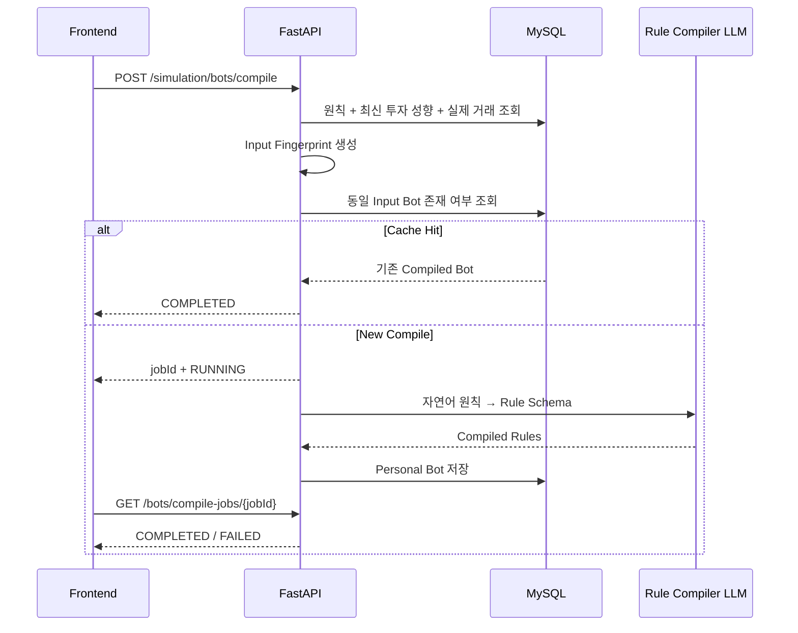

### Compile 중복 방지

같은 사용자가 버튼을 여러 번 누르거나 네트워크 재시도로 동일 요청을 반복해도 불필요한 LLM 호출이 중첩되지 않도록 두 단계로 방어합니다.

1. **Input Fingerprint Cache**  
   원칙·투자 성향·실제 거래 입력이 동일하면 이미 컴파일된 Bot을 재사용합니다.

2. **Per-user In-flight Job Deduplication**  
   이미 컴파일 작업이 실행 중이면 새로운 Job을 만들지 않고 기존 `jobId`를 반환합니다.

### AI가 추정한 규칙은 사용자 확인 대상으로 분리

자연어 원칙에 정확한 숫자가 없는 경우 Rule Compiler가 임계값을 추정할 수 있습니다.

```text
"한 종목에 너무 많이 투자하지 않는다"
        ↓
AI Rule Mapping
        ↓
max_single_position_weight = 0.2
        ↓
needs_user_confirmation
```

이 경우 추정된 규칙을 Audit 정보와 함께 반환하고, 별도의 Rule Confirmation API를 통해 사용자가 실행 기준을 확인할 수 있도록 설계했습니다.

---

# Backtest Engine

동일 기간과 초기 자본을 기준으로 여러 참가자를 동일한 이벤트 루프에서 비교합니다.

| Participant | Description |
| --- | --- |
| `ACTUAL_USER` | 실제 사용자가 수행했던 거래 흐름 |
| `PERSONAL_BOT` | 사용자의 투자 원칙으로 컴파일된 전략 |
| `FAMOUS_STRATEGY` | 가치·품질 중심 비교 전략 |
| `RANDOM_BOT` | 고정 Seed를 사용하는 랜덤 비교 전략 |

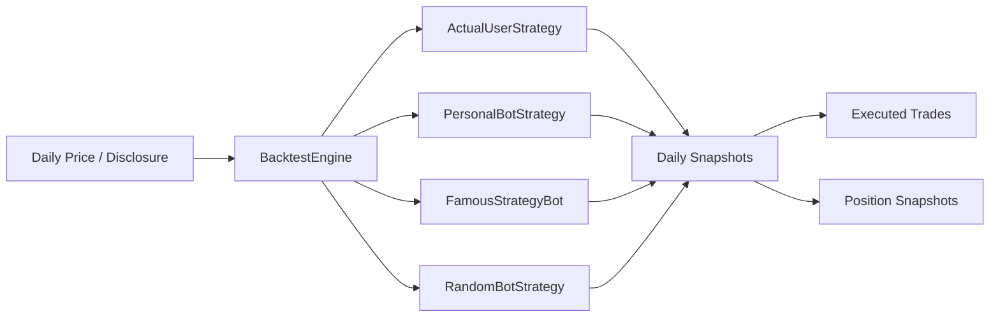

백테스트 결과는 단순 최종 수익률뿐 아니라 일별 상태와 주문 Audit을 함께 보존해 이후 복기 분석에서 사용합니다.

---

# Analytics Pipeline

백테스트가 완료된 뒤 수익률 숫자만 반환하지 않고 **왜 결과가 달라졌는지** 설명하기 위한 분석 파이프라인을 실행합니다.

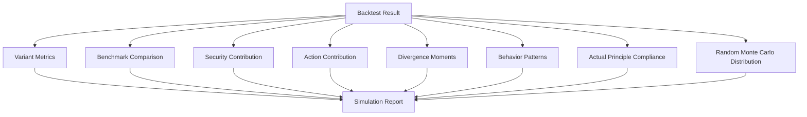

주요 분석 결과:

- 누적 수익률 / Total Equity
- 연환산 변동성
- Maximum Drawdown
- Benchmark 비교
- 종목별 수익 기여도
- 매수·매도 Action 기여도
- 실제 사용자와 Bot의 판단 분기 시점
- 투자 행동 패턴
- 실제 거래의 개인 원칙 준수 여부
- Random Bot Monte Carlo 분포 내 Personal Bot 위치

---

# Deterministic First, AI Second

리포트의 숫자와 핵심 판단을 LLM에 직접 맡기지 않습니다.

```text
Backtest / Analytics
        ↓
Deterministic Report
        ↓
DB 저장 + 즉시 조회 가능
        ↓
AI Narrative Enrichment
```

먼저 엔진과 Analytics 코드가 결정론적으로 결과를 계산하고 저장합니다. 이후 설명 문장만 별도 비동기 작업으로 AI가 보강합니다.

따라서 LLM 호출이 느리거나 실패해도 **수익률·원칙 평가·핵심 분석 결과 자체는 사용할 수 있습니다.**

리포트 Narrative 보강 작업도 동일 Simulation에 대해 중복 실행되지 않도록 in-progress set으로 제어합니다.

---

# Data & Persistence

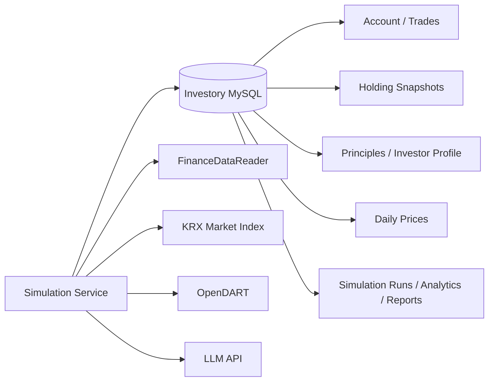

### 초기 자금 계산

시뮬레이션 시작일의 단순 현금 입력값을 사용하지 않고 계좌의 `holding_snapshots`를 기준으로 직전 보유 상태를 복원하여 초기 포트폴리오를 구성합니다.

### Simulation Cache

동일 사용자·기간·초기자금·참가자·Personal Bot 조건으로 이미 완료된 결과가 존재하면 재연산하지 않고 저장된 Simulation을 재사용합니다.

### DB Connection 수명 최소화

Simulation Repository는 데이터 로딩 단계에서 Connection을 재사용하지만, 이후 Backtest / Monte Carlo / Analytics와 같은 CPU 연산으로 넘어가기 전에 Connection을 명시적으로 반환합니다.

```text
DB 작업
  ├─ 계좌/초기 Snapshot
  ├─ 가격 데이터
  ├─ 실제 거래
  ├─ 원칙 / 공시
  └─ Benchmark
        ↓
Connection Close
        ↓
CPU-bound Simulation
```

이를 통해 긴 CPU 연산 동안 Connection Pool 슬롯을 점유하지 않도록 했습니다.

---

# Authentication

이 서버는 인증 토큰을 직접 발급하지 않습니다.

Investory Core Backend가 **RS256**으로 발급한 Access Token을 JWKS 공개키를 통해 검증합니다.

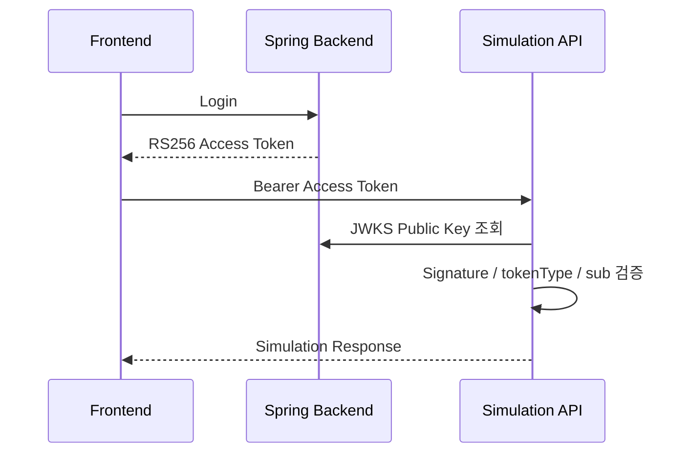

- `PyJWKClient`가 공개키 fetch / cache / rotation을 처리합니다.
- Simulation API는 Private Key를 갖지 않으므로 Core Backend의 사용자 토큰을 위조할 수 없습니다.
- `tokenType=ACCESS`와 `sub=userId`를 검증합니다.
- 다른 사용자의 Simulation ID를 조회하면 존재 여부 노출을 줄이기 위해 `404`로 처리합니다.

---

# Concurrency & Reliability

## 1. Bounded Simulation Worker Pool

무거운 작업 동시 실행 수를 제한합니다.

```python
ThreadPoolExecutor(
    max_workers=settings.SIMULATION_RUN_WORKERS,
    thread_name_prefix="sim-run",
)
```

Worker가 가득 차면 새로운 실행은 Queue에서 대기하므로 요청 수만큼 CPU 작업이 폭증하지 않습니다.

## 2. DB Connection Pool

SQLAlchemy Pool 설정을 환경 변수로 조절합니다.

```env
DB_POOL_SIZE=30
DB_POOL_MAX_OVERFLOW=20
DB_POOL_RECYCLE_SECONDS=1800
```

## 3. Failure State Persistence

비동기 작업 중 어느 단계에서 예외가 발생하더라도 `simulation_runs`를 `FAILED`로 마킹합니다.

이를 통해 클라이언트가 영원히 `RUNNING` 상태를 폴링하는 상황을 방지합니다.

## 4. Cache Hit Fast Path

동일 조건의 완료 Simulation을 찾은 경우 Worker Queue에 넣지 않고 즉시 `COMPLETED`를 반환합니다.

---

# Observability

Prometheus 형식의 `/metrics` 엔드포인트를 제공합니다.

HTTP 레벨에서는 다음을 수집합니다.

- Request Count
- Request Latency
- Method / Route Template / Status Code

Simulation 내부에서는 주요 단계별 실행 시간을 별도로 측정합니다.

```text
cacheLookup
dataLoad
backtest
monteCarlo
analytics
persistenceReservation
reportGeneration
```

동적 ID가 포함된 raw URL 대신 FastAPI Route Template을 metric label로 사용해 Prometheus 시계열 cardinality가 불필요하게 증가하지 않도록 했습니다.

---

# Batch Data Collection

서버 시작 시 시장 데이터 수집 Scheduler를 함께 시작합니다.

```text
Security Price
Fundamentals
Market Index
DART Disclosure
```

관련 모듈은 `app/modules/simulation/collectors` 아래에 분리되어 있으며, 서비스 종료 시 Scheduler와 Simulation / Monte Carlo Executor도 함께 shutdown합니다.

---

# API

API Prefix: `/simulation`

| Method | Endpoint | Description |
| --- | --- | --- |
| `GET` | `/overview` | 시뮬레이션 가능 기간 / 초기자금 / 준비 상태 |
| `GET` | `/initial-capital` | 시작일 기준 초기 포트폴리오 계산 |
| `POST` | `/bots/compile` | 자연어 원칙 → Personal Bot 비동기 컴파일 |
| `GET` | `/bots/compile-jobs/{jobId}` | Personal Bot Compile 상태 조회 |
| `GET` | `/bots/rule-confirmations` | AI 추정 실행 기준 조회 |
| `POST` | `/bots/rule-confirmations` | 추정 실행 기준 사용자 확정 |
| `GET` | `/bots/comparators` | 비교 참가자 목록 조회 |
| `POST` | `/run` | 시뮬레이션 Job 제출 |
| `GET` | `/{simulationId}/status` | Simulation 실행 상태 조회 |
| `GET` | `/history` | 과거 Simulation 목록 |
| `GET` | `/latest` | 최근 완료 Simulation |
| `GET` | `/{simulationId}` | Simulation 상세 결과 |
| `GET` | `/{simulationId}/report` | 복기 리포트 |

FastAPI 문서:

```text
/docs
/redoc
/simulation/openapi.json
```

---

# Project Structure

```text
app/
├─ api/
│  ├─ endpoints/
│  │  ├─ principles.py
│  │  ├─ simulation.py
│  │  ├─ simulation_helpers.py
│  │  └─ simulation_run_service.py
│  ├─ error_responses.py
│  └─ router.py
│
├─ core/
│  ├─ auth.py
│  └─ metrics.py
│
├─ modules/simulation/
│  ├─ analytics/
│  │  ├─ analytics.py
│  │  ├─ comparator_details.py
│  │  ├─ counterfactual.py
│  │  ├─ evidence_verification.py
│  │  ├─ report_analysis.py
│  │  └─ report_generator.py
│  │
│  ├─ collectors/
│  │  ├─ batch_cron.py
│  │  ├─ dart_collector.py
│  │  ├─ fundamentals_collector.py
│  │  ├─ market_index_collector.py
│  │  └─ security_price_collector.py
│  │
│  ├─ engine/
│  │  ├─ backtest.py
│  │  ├─ evaluator.py
│  │  ├─ strategies.py
│  │  └─ strategy_catalog.py
│  │
│  ├─ persistence/
│  │  ├─ capital_calculator.py
│  │  ├─ db_persistence.py
│  │  ├─ holding_snapshot_service.py
│  │  └─ repository.py
│  │
│  ├─ rules/
│  │  ├─ compiler.py
│  │  ├─ rule_schema.py
│  │  └─ strengthen_spec.py
│  │
│  ├─ llm_client.py
│  ├─ models.py
│  └─ prompts.py
│
├─ config.py
└─ main.py
```

---

# Tech Stack

| Category | Technology |
| --- | --- |
| API | FastAPI, Uvicorn, Pydantic |
| Language | Python 3.11 |
| Data Processing | pandas |
| Market Data | FinanceDataReader, KRX, OpenDART |
| Database | MySQL, SQLAlchemy, PyMySQL |
| Authentication | PyJWT, RS256, JWKS |
| AI | LLM-based Rule Compiler / Report Narrative |
| Concurrency | ThreadPoolExecutor, BackgroundTasks |
| Monitoring | Prometheus Client |
| Deploy | Docker |
| Test | Python `unittest`, `unittest.mock` |

---

# Local Development

## 1. Environment

Python `3.11+` 권장

```bash
python -m venv .venv
source .venv/bin/activate
pip install -r requirements.txt
```

Windows PowerShell:

```powershell
python -m venv .venv
.\.venv\Scripts\Activate.ps1
pip install -r requirements.txt
```

## 2. Environment Variables

`.env.example`을 참고하여 `.env.local` 또는 `.env`를 구성합니다.

주요 변수:

```env
OPENAI_API_KEY=
OPENDART_API_KEY=
KRX_OPEN_API_KEY=
AUTH_JWKS_URL=

MYSQL_HOST=
MYSQL_PORT=3306
MYSQL_USER=
MYSQL_PASSWORD=
MYSQL_DB=investory

REASONING_MODEL=
FAST_MODEL=
COMPILER_MODEL=
REPORT_MODEL=

DB_POOL_SIZE=30
DB_POOL_MAX_OVERFLOW=20
SIMULATION_RUN_WORKERS=4

PORT=8000
```

## 3. Run

```bash
uvicorn app.main:app --host 0.0.0.0 --port 8000 --reload
```

or

```bash
python run_server.py
```

## 4. Docker

```bash
docker build -t investory-simulation-api .
docker run --env-file .env -p 8000:8000 investory-simulation-api
```

---

# Tests

테스트 코드는 Python 표준 `unittest` 기반으로 구성되어 있습니다.

```bash
python -m unittest discover -s tests
```

주요 테스트 범위:

- 비동기 Personal Bot Compile / 실패 상태
- Compiled Bot Idempotency
- RS256 / JWKS 인증
- 실제 사용자 거래 실행
- 초기 자금 및 Holding Snapshot 복원
- Disclosure Rule
- Divergence Review
- Batch Scheduler
- API Error 응답 안전성
- Simulation / Analytics 세부 로직

---

# Ownership

Investory는 **Frontend 3명 + Backend 3명**이 함께 개발한 팀 프로젝트입니다.

이 저장소의 시뮬레이션 영역은 팀장 **홍상우**가 중심이 되어 설계·구현했습니다.

### 담당 범위

- Simulation 서비스 기획 및 전체 사용자 Flow 설계
- Simulation Frontend UI/UX 및 API Integration
- Python / FastAPI Simulation Server
- 자연어 투자 원칙 → Rule Schema Compiler 흐름
- Backtest Engine 및 비교 전략 흐름
- 비동기 Compile / Simulation Job 구조
- Simulation Analytics / Result Report 연동
- Frontend ↔ Spring Core Backend ↔ Simulation API 통합

> 팀 프로젝트의 전체 Backend와 Frontend 기능은 각 팀원이 역할을 나누어 개발했으며, 이 문서는 그중 Simulation 시스템의 기술 구조를 중심으로 설명합니다.

---


# Repository Integration

Investory는 하나의 거대한 서버로 모든 기능을 처리하지 않고, **역할이 다른 4개의 Repository**로 서비스를 분리했습니다.

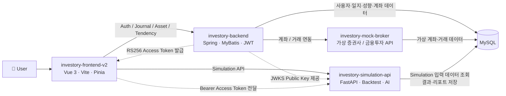

## Repository별 책임

| Repository | Main Responsibility | Simulation과의 연결 |
| --- | --- | --- |
| `investory-frontend-v2` | 사용자 UI, 일지·성향·시뮬레이션 Flow | `/api/simulation/*` 요청을 FastAPI 서버로 전달하고 Job 상태를 polling |
| `investory-backend` | 인증, 사용자, 계좌, 투자 일지, 투자 성향 Core API | RS256 Access Token 발급 및 JWKS 공개키 제공, Simulation이 사용할 사용자 데이터를 DB에 관리 |
| `investory-simulation-api` | Personal Bot, Backtest, Analytics, Report | Core DB의 계좌·거래·원칙·성향 데이터를 읽어 시뮬레이션하고 결과를 다시 저장 |
| `investory-mock-broker` | 실제 증권사를 대체하는 가상 금융투자 API | 계좌·보유종목·거래 데이터 흐름을 재현해 Core Backend의 금융 연동 시나리오 지원 |

---

## Frontend ↔ Simulation API

개발 환경에서 Frontend는 Vite Proxy를 통해 Java Core Backend와 Python Simulation API를 분리해서 호출합니다.

```text
Frontend
├─ /api/simulation/*  → Python FastAPI
│
├─ /auth/*
├─ /journal/*
├─ /market/*
└─ /tendency/*        → Java Spring Backend
```

시뮬레이션 사용자 Flow는 다음과 같습니다.

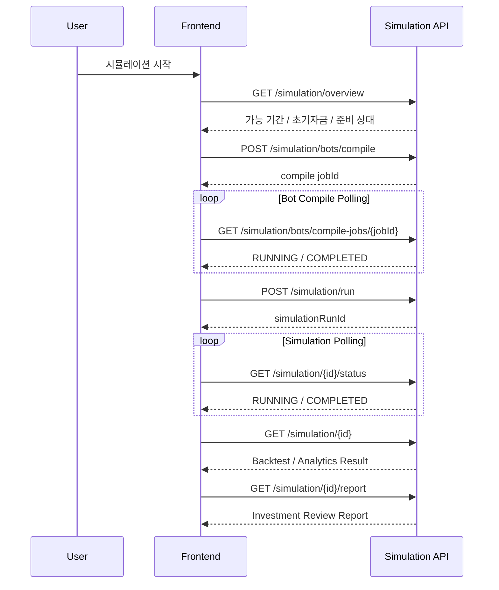

Frontend에서는 Pinia가 현재 시뮬레이션 Flow와 Job 상태를 관리하고, TanStack Vue Query가 Overview / Comparator / Detail / Report와 같은 서버 상태를 캐시합니다.

---

## Core Backend ↔ Simulation API

두 Backend는 동일한 역할을 중복해서 구현하지 않습니다.

```text
Spring Core Backend
├─ 로그인 / 사용자
├─ 투자 일지
├─ 계좌 / 거래 데이터
├─ 투자 성향
└─ Access Token 발급

FastAPI Simulation Backend
├─ 투자 원칙 Rule Compile
├─ Personal Bot
├─ Backtest
├─ Monte Carlo
├─ Analytics
└─ Simulation Report
```

### 인증 연결

Simulation API가 Spring Backend의 인증 비밀키를 공유하지 않도록 **RS256 + JWKS** 구조를 사용합니다.

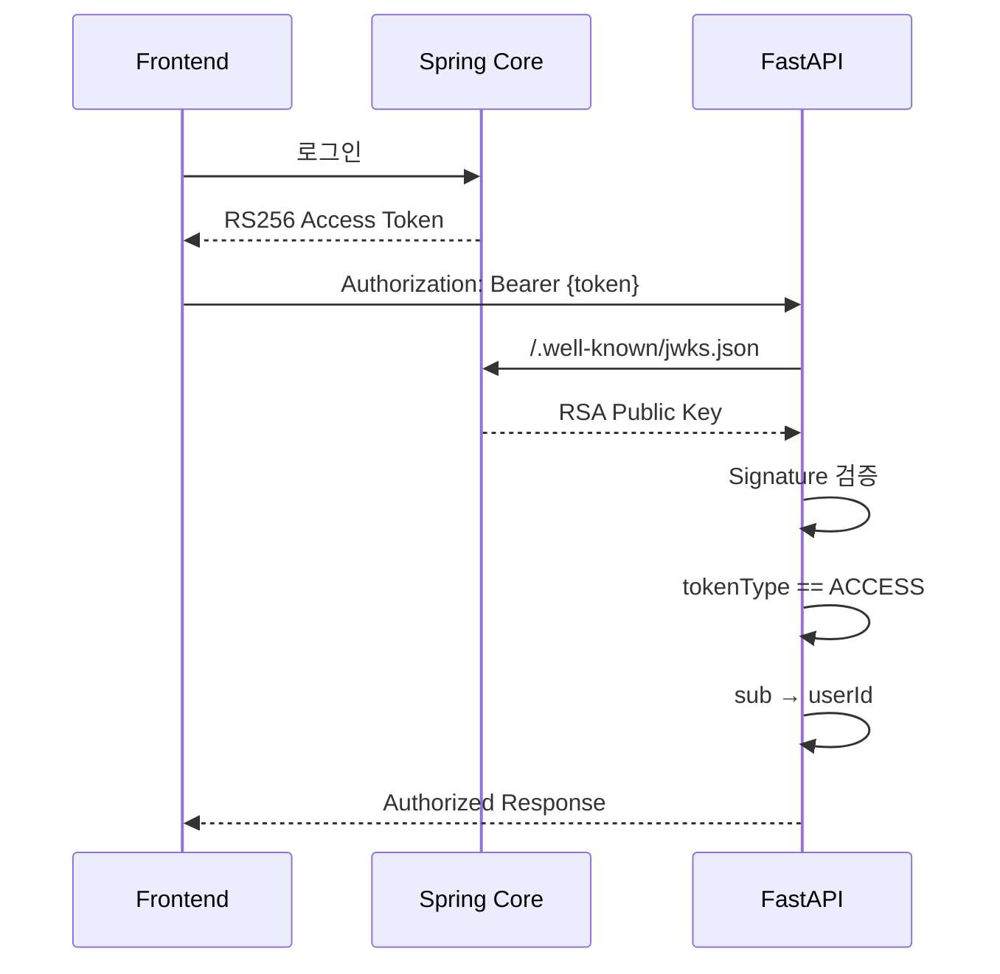

이 구조에서는:

- Private Key는 **Core Backend만 보유**합니다.
- Simulation API는 Public Key로 **검증만 수행**합니다.
- Simulation 서버가 침해되어도 Core Backend의 사용자 토큰을 새로 발급할 수 없습니다.
- 서비스 간 인증 책임을 분리하면서도 동일한 사용자 Identity를 유지할 수 있습니다.

---

## Shared Data Flow

Simulation API가 동작하려면 사용자의 시뮬레이션 요청만으로는 충분하지 않습니다.

Core Backend와 Broker 영역에서 축적된 실제 투자 데이터를 함께 사용합니다.

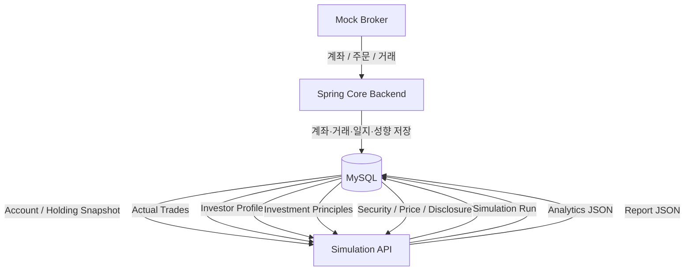

### Simulation이 사용하는 주요 데이터

| Data | 사용 목적 |
| --- | --- |
| Account / Holding Snapshot | 시뮬레이션 시작 시점의 실제 초기 포트폴리오 복원 |
| Actual Trades | 실제 사용자 전략(`ACTUAL_USER`) 재현 |
| Investor Profile | 자연어 투자 원칙 Rule Compile Context |
| Investment Principles | Personal Bot 전략 생성 및 원칙 준수도 분석 |
| Security / Daily Price | Backtest Event Loop |
| Disclosure | 공시 기반 Rule 및 매매 판단 |
| Simulation Runs | 완료 결과 Cache / History / Detail |
| Analytics / Report JSON | 결과 복기 화면 및 재조회 |

---

## Mock Broker의 위치

`investory-mock-broker`는 Simulation Engine 자체를 실행하는 서버가 아닙니다.

실제 증권사 연동이 없는 개발 환경에서도 **계좌 조회 → 보유 종목 → 거래 → 주문 반영** 흐름을 검증할 수 있도록 금융투자 정보제공 API 역할을 재현합니다.

```text
Mock Broker
      ↓
계좌 / 보유종목 / 거래 데이터
      ↓
Core Backend
      ↓
Investory DB
      ↓
Simulation API
      ↓
Actual User Backtest
```

따라서 Simulation 입장에서는 Mock Broker와 직접 강하게 결합하지 않고, **Core Backend와 DB에 축적된 표준화된 투자 데이터**를 입력으로 사용합니다.

이 구조 덕분에 향후 실제 증권사 또는 마이데이터 연동으로 교체하더라도 Simulation Engine의 핵심 로직은 그대로 유지할 수 있습니다.

---

## End-to-End Service Flow

4개 Repository를 하나의 사용자 경험으로 연결하면 전체 흐름은 다음과 같습니다.

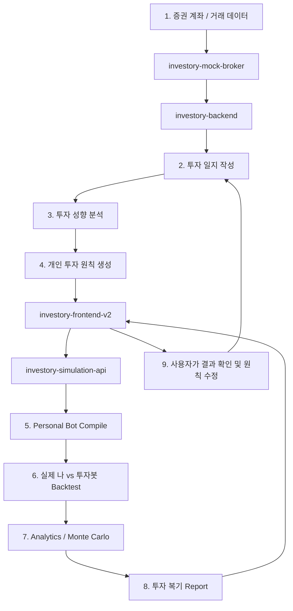

> Investory의 Repository 분리는 기술 스택을 나누기 위한 목적이 아니라,  
> **인증·투자 기록·금융 데이터·고비용 시뮬레이션이라는 서로 다른 변경 주기와 부하 특성을 분리하기 위한 구조**입니다.

---

# Related Repositories

| Repository | Responsibility |
| --- | --- |
| [`investory-frontend-v2`](https://github.com/kb-investory/investory-frontend-v2) | Vue 기반 서비스 Frontend |
| [`investory-backend`](https://github.com/kb-investory/investory-backend) | 인증 · 계좌 · 투자 일지 · 투자 성향 Core API |
| [`investory-simulation-api`](https://github.com/kb-investory/investory-simulation-api) | Personal Bot / Backtest / Analytics / Report |
| [`investory-mock-broker`](https://github.com/kb-investory/investory-mock-broker) | 금융투자 규격 기반 가상 증권사 |

---

<div align="center">

### 투자 원칙은 말로 끝나는 것이 아니라, 검증할 수 있어야 합니다.

**Principle → Rule → Simulation → Evidence → Review**

[🌐 Investory](https://www.investory.kr)

</div>
